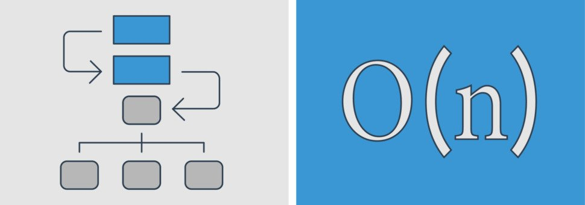
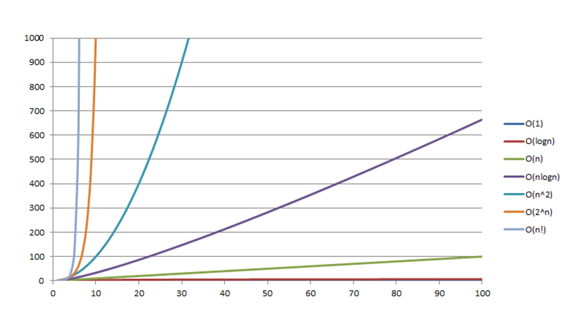

Алгоритмы
---

Алгоритмы или очередной фреймворк? Во что вложиться? Для того, чтобы кодить, знание алгоритмизации не требуется, если ты знаешь инструмент который
тебе поможет решить поставленную задачу. Но решил ли ты её наилучшим способом?

Если ты заинтересован в качестве — алгоритмы твоя тема. Нет — продолжай гвонокодить и учи очередной фреймворк.

Алгоритм – набор команд определённой последовательности для решения поставленной задачи. Пишутся они в основном для сложных задач, или для дураков для
кого лёгкие задачи кажутся сложными.

В алгоритмах важно оценивать:

- Качество
- Скорость
- Требования к ресурсам
- Повторное использование

Качество — наилучшее ли это решение, возможно есть другие. Лучший выбор ли ты сделал? Скорость — какова его асимптотическая сложность? Требования к
ресурсам — хватит ли у тебя оперативки? Повторное использование — можешь ли ты заюзать повторно для решения схожих задач?

### Асимптотическая сложность

Асимптотическая сложность алгоритма определяется функцией, которая указывает как ухудшается работа алгоритма при усложнении поставленной задачи.
Определяется функцией, которую пишут в круглых скобках с буквой O. Например — O(N), читается как «порядок N».

### Производительность алгоритмов

#### O(1)

Выполняется за одинаковый период времени независимо от количества элементов.

#### O(log N)

Делит количество элементов на фиксированный коэффициент при каждом шаге.

#### O(N)

Сложность возрастает линейно относительно количества элементов.

#### O(N log N)

Алгоритм выполняет операцию O(log N) и на каждом шаге выполняет обработку элемента.

#### O(N^2)

Перебор каждого элемента при котором для каждого элемента осуществляется перебор каждого элемента.

#### O(2^N)

Экспоненциальная функция. Лучше не юзать. Часто можно заметь на эвристический алгоритм — дающий приемлемый результат, но не наилучший.

#### O(N!)

“N факториал”. С подобной скоростью роста функции, как правило, ищут оптимальное распределение входных данных.

### Резюме

Учтите, что при расчёте сложности алгоритма считается, что шаги выполняются за одинаковый период времени. Но в жизни зачастую это не так. Нужно так же
учитывать среду выполнения.

Мы живём во времена когда алгоритмы уже все написаны за нас. Возможно вам не прийдётся писать их самому, но зная как они работают вы сможете управлять
уже готовыми осознано.
